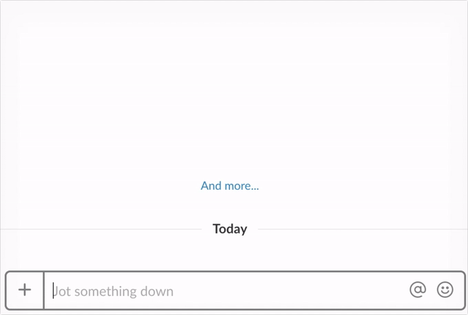

# PwnBot


PwnBot is a fun game to emphasize the importance of locking your computer. An unlocked computer can be used to access accounts, retrieve passwords and install malicious software to compromise entire organizations.

> It doesn't matter how strong your lock is if you leave the front door open

PwnBot rewards a point to a person who calls it on someone else's **unlocked computer**, while taking away points from the person who left their computer unlocked. The score board is visible to everyone, not getting got is the incentive. This also removes the stigma of locking someone else's computer, so any unlocked computer will not stay that way for long.

<a href="https://slack.com/oauth/authorize?scope=commands&client_id=2822474254.280303064630" target="_blank"></a>

*This Slack Application is provided for free with no uptime or SLA guarantees. Enjoy*

### Commands

You call PwnBot in Slack on someone else's **unlocked computer** with `/pwn @<your_name>`, this will give you a point. The aim is to get points while not getting got.



Check the scoreboard with `/pwn` which lists who has be PWNed the most and who has the most PWNS.


## Deploy your own

PwnBot runs as a Lambda function backed by DynamoDB, called via API gateway. This is defined as a [GeoEngineer](https://github.com/coinbase/geoengineer) project in `resources/pwnbot.rb`. To create these resources you will need [`terraform`](https://www.terraform.io/intro/getting-started/install.html), [`bundler`](http://bundler.io/), and [`npm`](https://docs.npmjs.com/cli/install) installed. Then:

```
export AWS_ACCOUNT_ID=<AWS ACCOUNT ID> # The AWS account to deploy PwnBot into
bundle # install GeoEngineer and other required gems
./geo apply resources/pwnbot.rb
```

This will show you a plan to create the resources that you must approve. Once applied either:

1. Setup a custom [slack-command](https://api.slack.com/slash-commands)
2. Setup your own [Slack App](https://api.slack.com/apps)

To ensure that only you can call your PwnBot, make sure to add the environment variable `SLACK_TOKEN=<YOUR SLACK TOKEN>` to the lambda. You can also customize the time pwns will stay around with `EXPIRY_HOURS` (default is 30 days).

### Friendship is Magic
Making the list of Slack uses that have been pwned public can have cultural impact. If you would like to keep the PWNED output private in the Slack channel, set an environment variable:
```sh
FRIENDSHIP_IS_MAGIC=1
````

### Discussions and Links

1. Coinbase Director of Security describing PwnBot on [Software Engineering Daily](https://softwareengineeringdaily.com/2017/07/14/coinbase-security-with-philip-martin/)

